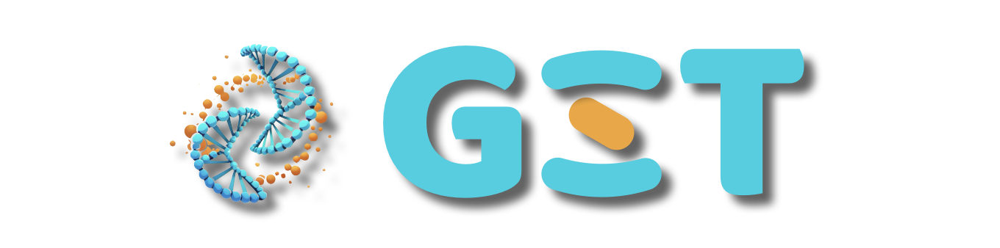
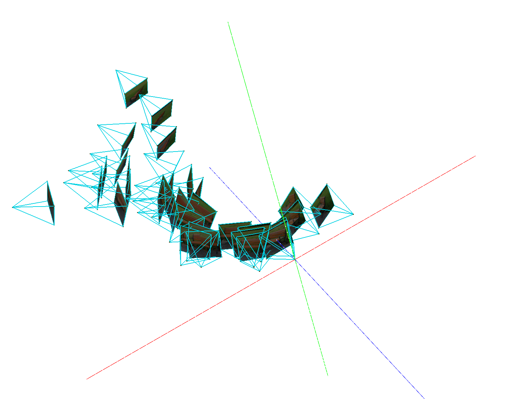

<p align="center">

<p>

# 🧬 Generative Spatial Transformer (GST) 

Implementation of GST from <a href="https://sotamak1r.github.io/gst/"><i>Where Am I and What Will I See</i> : An Auto-Regressive Model for Spatial Localization and View Prediction</a> in Pytorch.


<div align="center">

[](https://www.arxiv.org/abs/2410.18962)&nbsp;
[](https://sotamak1r.github.io/gst/)&nbsp;
[](https://huggingface.co/SOTAMak1r/GST/tree/main)&nbsp;

</div>

## ✨️ News

* **2025-2:** Code is released.

## 🛠️ Installation

1. Environment setting
```
conda create -n gst python=3.8

pip install -r requirements.txt
```

2. Model weight download

We provide Image tokenizer, Camera tokenizer, and Auto-regressive model in [](https://huggingface.co/SOTAMak1r/GST/tree/main)&nbsp;. Please download the following three ckpt and place them in the folder `./ckpts`.

```
image-16.pt # Adopting from LlamaGen
camera-4.pt
gst.pt
```


## 🚀 Inference

GST has constructed a joint distribution of images and corresponding perspectives. 
Use the following command to sample `--num-sample` perspectives and images under a given observation `--image-path`.

```
python run_sample_camera_image.py \
    --image-ckpt   /path/to/image-16.pt  \
    --gpt-ckpt     /path/to/gst.pt \
    --camera-ckpt  /path/to/camera-4.pt \
    --image-path assets/hydrant.jpg \
    --num-sample 16 
```

More optional parameters can be found in the script `run_sample_camera_image.py`.
After sampling, the results will be saved in the folder `sample`. 
The folder structure is as follows:

```
sample
├── camera.ply      # Saved the 3D position and orientation of the perspectives
├── images.obj      # Saved the images corresponding to each perspective
│   
├── material_0.png  # Texture
├── material_1.png 
├── ...
├── material.mtl    # Texture mapping of 3D files
│   
├── sample_0.png    # Sampled image
├── sample_0.npy    # The camera matrix obtained by converting the sampled camera
├── sample_1.png 
├── sample_1.npy 
└── ...
```


The GST employs the RDF coordinate system, 
where the positive direction of the x-axis is oriented to the right (R), 
the positive direction of the y-axis is directed downward (D), 
and the positive direction of the z-axis is oriented forward (F). 
The sampled ply and obj files can be opened in `meshlab` or other three-dimensional software, as illustrated below:


<p align="center">
  
<p>

## 📃 License

The majority of this project is licensed under MIT License. Portions of the project are available under separate license of referred projects, detailed in corresponding files.

## ✨ Citation

If our work assists your research, feel free to give us a star ⭐ or cite us using:
```
@article{chen2024and,
  title={Where Am I and What Will I See: An Auto-Regressive Model for Spatial Localization and View Prediction},
  author={Chen, Junyi and Huang, Di and Ye, Weicai and Ouyang, Wanli and He, Tong},
  journal={arXiv preprint arXiv:2410.18962},
  year={2024}
}
```

## 💖 Acknowledgement

We would like to express our gratitude to the contributors of the codebase provided by <a href="https://github.com/FoundationVision/LlamaGen">LlamaGen</a>, 
which served as the foundation for our work. 
Additionally, we acknowledge the valuable insights drawn from the works of B and C, which significantly influenced the direction of our research. 
Special thanks are extended to the pioneering contributions of <a href="https://github.com/cvlab-columbia/zero123">Zero123</a>, <a href="https://github.com/kylesargent/zeronvs">ZeroNVS</a> and <a href="https://github.com/jasonyzhang/RayDiffusion">RayDiffusion</a> within the field, which have enriched our understanding and inspired our endeavors.
